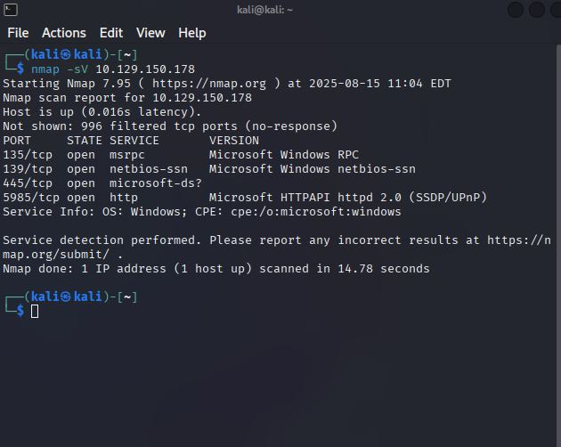

 # Starting Point - Dancing - HTB Write Up 

**Date:** 7/15/2025
**Difficulty:** Very Easy 
**IP:** 10.129.150.178
**Status:** Public (Starting Point) 
**Author:** J-D-J123 

## Objective 
To learn the SMB (Server Message Block) The communication protocol provides shared access to files, 
printers and serial ports between endpoints on a network. Most common on Windows machines. 

### Steps Taken 

1. **Recon**
   - nmap -sV 10.129.150.178
   - Found open port 445 runing microsoft-ds


### Tasks

1. What does the 3-letter acronym SMB stand for?
```bash
Server Message Block
```

2. What port does SMB use to operate at?
```bash
445
```

3. What is the service name for port 445 that came up in our Nmap scan?
```bash
microsoft-ds
```

4. What is the 'flag' or 'switch' that we can use with the smbclient utility to 'list' the available shares on Dancing?
```bash
 
```
