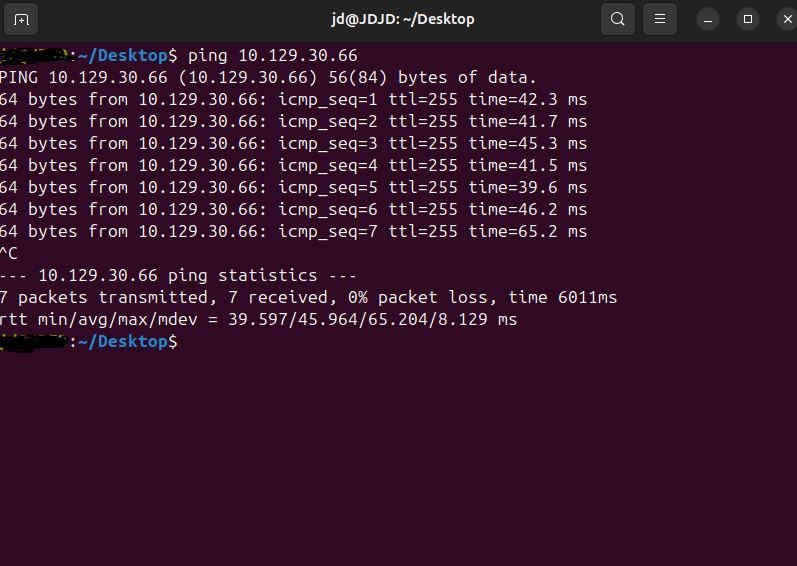
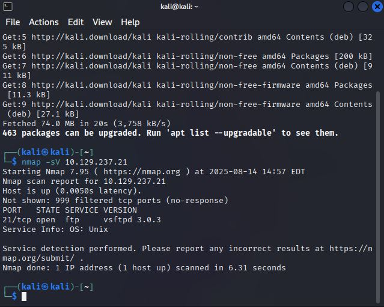
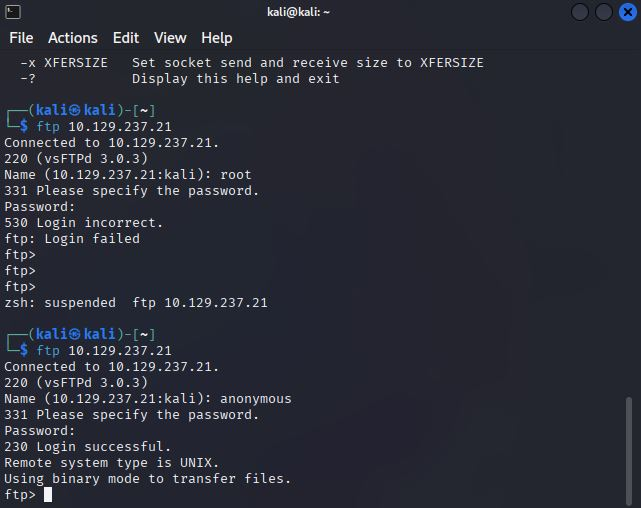

 # Starting Point - Fawn - HTB Write Up 

**Date:** 7/14/2025
**Difficulty:** Very Easy 
**IP:** 10.129.30.66
**Status:** Public (Starting Point) 
**Author:** J-D-J123 

## Objective 
Gain access to the FTP (File Transfer Protocol) service 

### Tasks

1. what does the 3-letter acronym FTP stand for?
```bash
File Transfer Protocol
```

2. Which port does the FTP service listen on usually?
```bash
21
```

3. FTP sends data in the clear without any encryption. What acronym is used for a later protocol designed to provide 
similar functionality to FTP but securely, as an extension of the SSH protocol?
```bash
SFTP
``` 

4. What is the command we can use to send an ICMP echo request to test our connection to the target?
```bash
ping
```



5. From your scans, what version is FTP running on the target?
```bash
vsftpd 3.0.3
```

6. From you scans, what OS type is running on the target?
```bash
Unix
```



7. What is the command we need to run in order to display the 'ftp' client help menu?
```bash
ftp -?
```

8. What is the username that is used over FTP when you want to log in without having an account?
```bash
anonymous
```

9. What is the responce code we get for the FTP message "Login successful"?
```bash
230
```



10. There are a couple of commands we can use to list the files and directories available on the FTP server.
One is dir. What is the other taht is common way to list files on a Linux system.
```bash
ls
```

11. What is the command used to download the file we found on the FTP server?
```bash
get
get <filename>
get flag.txt
```
